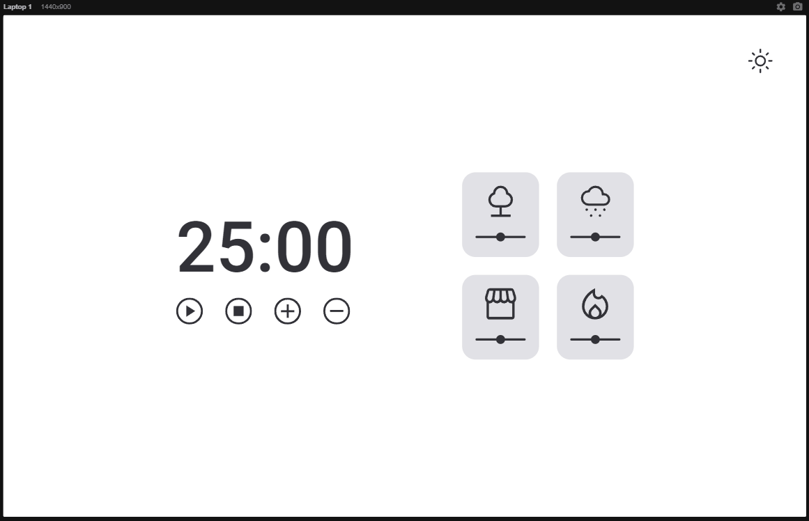
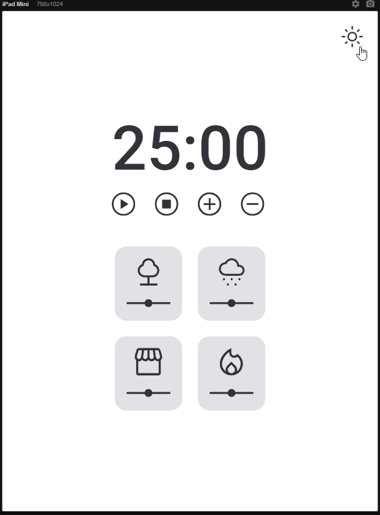
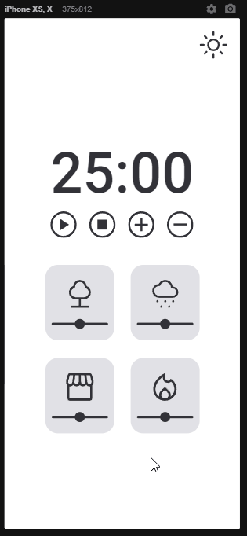

# Explorer_Desafio_Pomofocus_3.0

## A pomodoro focus timer with sounds

	<a href="#computer-about">About</a> •
 	<a href="#art-layout">Layout</a> • 
 	<a href="#clipboard-how-to-use">How to use</a> • 
 	<a href="#rocket-technologies">Tech Stack</a> • 
 	<a href="#dart-author">Autor</a> • 
 	<a href="#memo-license">License</a>

### :computer: About

In this challenge, it was requested to create a Pomofocus, a pomodoro countdown to focus with 4 sound options.  
The page should display a pomodoro timer and user can set timer each 5 minutes.
We have 4 options of sounds: Forest, rainy, a firecamp and a coffee shop.
A button to switch between light and dark mode colors.

I had the oportunity to practice and study:
*	Manipulate DOM;
*	Event-driven and callbacks;
*	ES6 Modules;
*	Objects with Factory and Dependency injection.

As a "extra mile" and to chalenge myself I included some features:
*	Included pause button to allow user pause the timer (animation toggle between pause and play buttons);
*	Stop button reset the timer to the original time defined;
*	Volume control can set the volume individualy at same time with other sounds;
*	Alert mesage to "maximum 99 minutes" and "minimum 1 minute" to set timer
*	User can combine more than one sound;
*	Animation "click sound" to pause, play and stop button;
*	A hover color in timer control buttons;
*	A mobile version.

---

### :art: Layout

### Desktop

	

### Tablet and Mobile

	
	

---

### :clipboard: How To Use

Just access the link bellow:

<a href="https://dan-padovani.github.io/Explorer_projeto06_Pomofocus_timer/" target="_blank">Pomofucus timer</a>

---

### :rocket: Technologies

---

### :dart: Author

	Made with &#128150 by Daniel Padovani &#128075 Entre em contato! 	

    

---

### :memo: License

This project is under the MIT license. See the [LICENSE](link/master/LICENSE) for more information.
